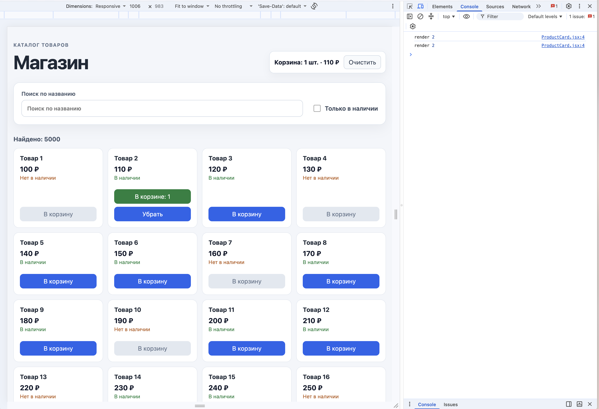

# S03

```bash
npm install
npm run dev
```

## Что реализовано

- каталог из 5000 товаров;
- поиск по названию и фильтр «Только в наличии»;
- корзина с добавлением, удалением и очисткой;
- подсчёт количества товаров и общей стоимости;
- `useMemo` для фильтрации и вычисления производных данных;
- `React.memo` для карточки товара;
- `useCallback` для стабильных обработчиков корзины;
- `useTransition` для отложенной фильтрации списка;
- пользовательский хук `useCart`;
- сохранение корзины в `localStorage`;
- передача корзины через Context;
- `ErrorBoundary` для списка товаров с кнопкой «Повторить».

## Доп



Две строки потому что включен StrictMode.

Без `useCallback` обработчики создавались бы заново на каждом рендере. Для `React.memo` это были бы новые значения props, и карточки перерисовывались бы снова.

## Команды проекта

```bash
npm run dev
npm run lint
npm run build
```
